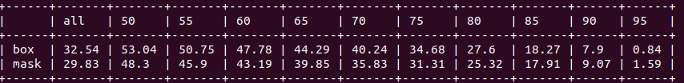

## Environments  
PyTorch >= 1.1.  
Python >= 3.6.  
tensorboardX  
Other common packages.  

## Prepare
- Download COCO 2017 datasets, modify the paths of training and evalution datasets in `data/config.py`. 
- Download weights.

Yolact trained weights.  

|Backbone   | box mAP  | mask mAP  | Google Drive                                                                                                         |Baidu Cloud          |
|:---------:|:--------:|:---------:|:--------------------------------------------------------------------------------------------------------------------:|:----------------------------------------------------------------:|
|Resnet50   | 30.25    | 28.04     | [res50_coco_800000.pth](https://drive.google.com/file/d/1kMm0tBZh8NuXBLmXKzVhOKR98Hpd81ja/view?usp=sharing)  |[password: mksf](https://pan.baidu.com/s/1XDeDwg1Xw9GJCucJNqdNZw) |
|Resnet101  | 32.54    | 29.83     | [res101_coco_800000.pth](https://drive.google.com/file/d/1KyjhkLEw0D8zP8IiJTTOR0j6PGecKbqS/view?usp=sharing)      |[password: oubr](https://pan.baidu.com/s/1uX_v1RPISxgwQ2LdsbJrJQ) |

ImageNet pre-trained weights.  

| Backbone  | Google Drive                                                                                                    |Baidu Cloud                                                        |
|:---------:|:---------------------------------------------------------------------------------------------------------------:|:-----------------------------------------------------------------:|
| Resnet50  | [resnet50-19c8e357.pth](https://drive.google.com/file/d/1Uwz7BYHEmPuMCRQDW2wD00Jbeb-jxWng/view?usp=sharing)     | [password: a6ee](https://pan.baidu.com/s/1aFLE-e1KdH_FxRlisWzTHw) |
| Resnet101 | [resnet101_reducedfc.pth](https://drive.google.com/file/d/1vaDqYNB__jTB7_p9G6QTMvoMDlGkHzhP/view?usp=sharing)   | [password: kdht](https://pan.baidu.com/s/1ha4aH7xVg-0J0Ukcqcr6OQ) |


## Train
Note: this project may not support multi-GPU training well. Due to the lack of device resource, I can't check this at present.
```Shell
# Train with resnet101 backbone on coco2017 with a batch size of 8 (default).
python train.py --config=res101_coco_config
# Train with resnet50 backbone on coco2017 with a batch size of 8.
python train.py --config=res50_coco_config
# Train with different batch_size (remember to set freeze_bn=True in `config.py` when the batch_size is smaller than 4).
# You might also tune the learning rate and learning rate decay by yourself.
python train.py --config=res101_coco_config --batch_size=4
# Train with different image size (anchor settings related to image size will be adjusted automatically).
python train.py --config=res101_coco_config --img_size=400
# Resume training with the latest trained model.
python train.py --config=res101_coco_config --resume latest
# Resume training with a specified model.
python train.py --config=res101_coco_config --resume latest_res101_coco_35000.pth
# Set evalution interval during training, set -1 to disable it.  
python train.py --config=res101_coco_config --val_interval 20000
```
## Use tensorboard
```Shell
tensorboard --logdir=tensorboard_log
```

## Evalution
```Shell
# Evaluate on COCO val2017 (configs will be parsed according to the model name).
python eval.py --trained_model=res101_coco_800000.pth
```
The results should be:


```Shell
# Evaluate with a specified number of images.
python eval.py --trained_model=res101_coco_800000.pth --max_num=1000
# Create a json file and then use the COCO API to evaluate the COCO detection result.
python eval.py --trained_model=res101_coco_800000.pth --cocoapi
```
